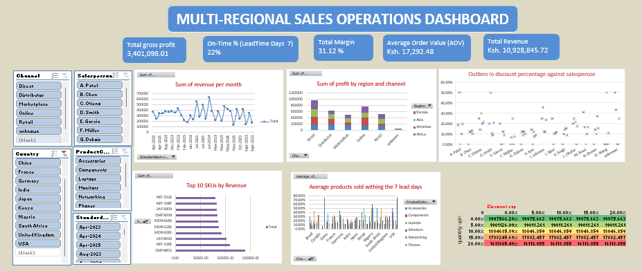

# Project Overview

This project analyzes transactional sales data for a multi-regional electronics distributor using Microsoft Excel. The objective was to clean, transform, analyze, and visualize sales performance across regions, countries, channels, products, and sales teams while building a dynamic what-if model to evaluate business scenarios.

The project demonstrates end-to-end data analytics skills including data cleaning, feature engineering, cohort analysis, ABC classification, performance measurement, service-level monitoring, pricing compliance analysis, and scenario modeling.

---

## Data Preparation & Methodology

### Data Quality Issues Identified

- Missing values in **City**, **Salesperson**, and **Channel**.
- Invalid date relationships where **RequiredDate** occurred earlier than **OrderDate**.
- Discount values exceeding normal business thresholds (**>30%**).
- Missing categorical values affecting segmentation and reporting.
- No exact duplicate records were identified.

### Data Cleaning Rules Applied

- Missing values were replaced with **"Unknown"** to preserve records and maintain reporting consistency.
- Invalid RequiredDate values were corrected by adding **14 days** to the corresponding OrderDate.
- LeadTimeDays was recalculated using corrected dates.
- High discounts were retained but flagged for further analysis.

### Derived Metrics

The following business metrics were created:

```text
GrossRevenue = UnitPrice × Quantity × (1 − DiscountPct)
CostOfGoods = UnitCost × Quantity
GrossProfit = GrossRevenue − CostOfGoods
MarginPct = GrossProfit ÷ GrossRevenue
LeadTimeDays = RequiredDate − OrderDate
```

### Standardized Dimensions

- Month (MMM-YYYY)
- Quarter (Q1–Q4)
- Region Hierarchy (Region → Country → City)
- PriceBand (Low, Medium, High) using quantile-based segmentation

---

## Analysis Performed

### Cohort Analysis
Tracked revenue generation from the first month each country appeared in the dataset.

### ABC Analysis
Classified SKUs within each ProductCategory based on cumulative GrossRevenue contribution:

- A: Top 80%
- B: Next 15%
- C: Final 5%

### Salesperson Productivity
Measured:
- Revenue per Order
- Orders per Month
- Gross Profit per Order

### Channel Performance
Compared revenue contribution across Retail, Online, Distributor, and Marketplace channels to identify shifts in customer purchasing behavior.

### Service Level Analysis
Measured the percentage of orders meeting a 7-day lead-time target by Country and Product Category.

### Price Compliance
Evaluated the share of orders receiving discounts above 20% and identified regional and salesperson outliers.

### Scenario Modeling
Built a dynamic what-if model using:
- Global Discount Cap (0–25%)
- Unit Cost Inflation (0–15%)
- Quantity Uplift (0–20%)

Revenue and profitability were recalculated under different business scenarios and compared against baseline performance.

---

## Key Findings

- **Europe** generated the highest overall Gross Profit (~869,836), narrowly outperforming the Americas.
- The **Americas** recorded the strongest Online and Direct channel performance, indicating successful digital sales adoption.
- **Africa** remained heavily dependent on Retail and Distributor channels, presenting opportunities for online growth.
- **Asia** demonstrated the most balanced channel mix, reducing reliance on any single revenue stream.
- Significant differences were observed in salesperson productivity, with top performers generating substantially higher revenue per order than their peers.
- Service-level performance was below the 7-day target across most countries and product categories, achieving an overall compliance rate of approximately **21.8%**.
- Revenue trends displayed noticeable fluctuations over time, suggesting potential seasonality and changing demand patterns.
- Scenario analysis revealed that profitability is highly sensitive to cost inflation and discount policies, highlighting the importance of balancing growth and margin protection.

---

## Assumptions

- Missing categorical values were classified as **Unknown** rather than removed.
- Discounts greater than 30% were treated as potential anomalies but retained for analysis.
- Service-level performance was evaluated using a 7-day lead-time target.
- Price bands were generated using quantile-based segmentation to ensure balanced classification.
- Scenario model inputs were applied consistently across all transactions.

---

## Tools Used

- Microsoft Excel
- PivotTables & Pivot Charts
- Conditional Formatting
- Data Validation
- Scenario Modeling
- Cohort Analysis
- ABC Analysis

---

## Dashboard Preview

```html
<p align="center">
  
</p>
```

---

## Author

**Alex Murithi**  
BSc Applied Science (Geoinformatics)  
Aspiring Data Analyst | GIS & Geospatial Analytics Enthusiast
